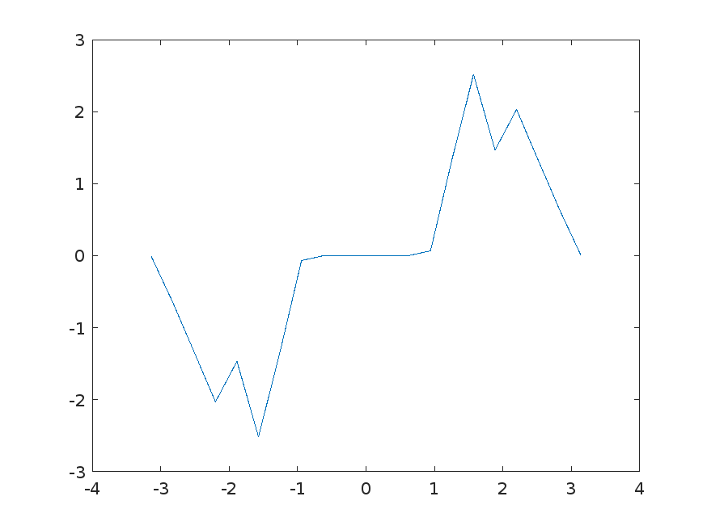

# Base 64 App

1. MATLAB [script](base64encoding.m) creating a base64 string from a plot

2. Small [app](app.html) loading image from base64:

**Alternative approach in MATLAB**:
https://www.mathworks.com/matlabcentral/fileexchange/24514-base64-image-encoder